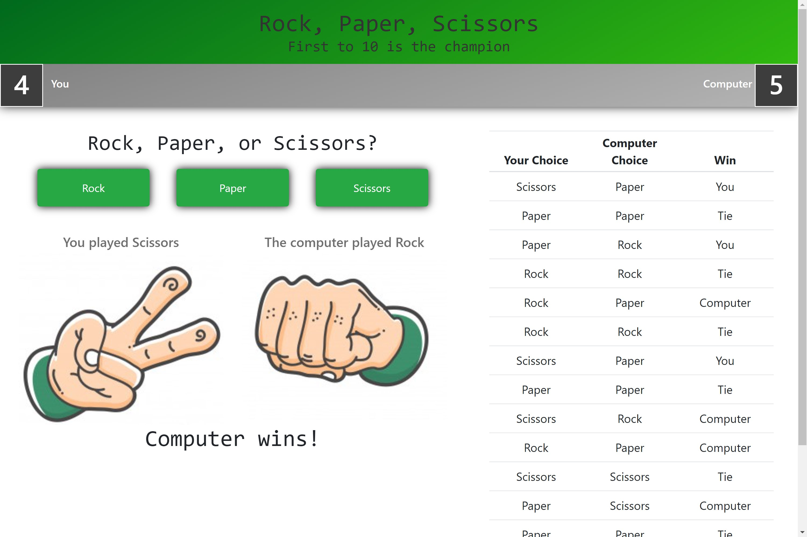
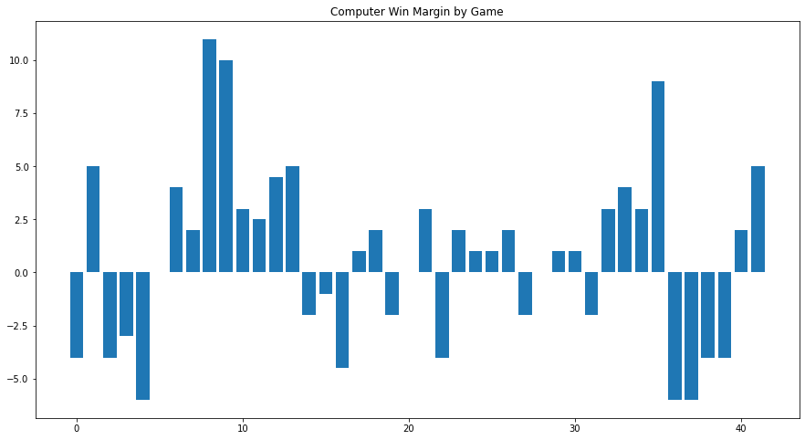
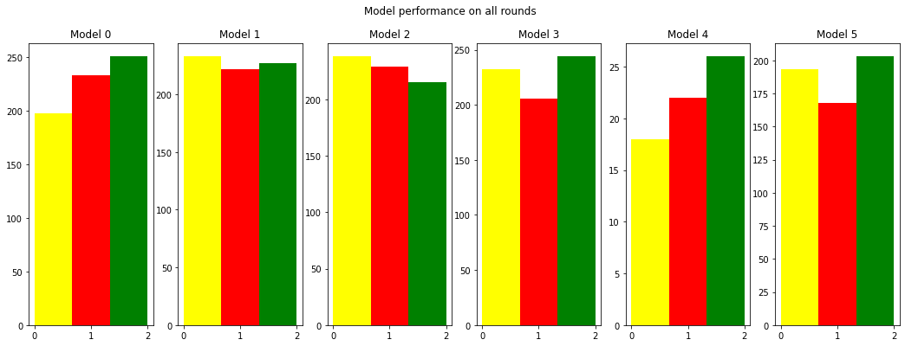
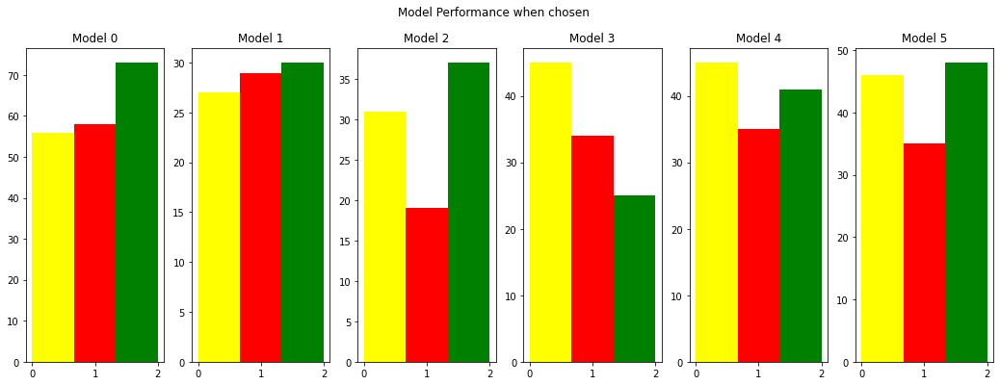
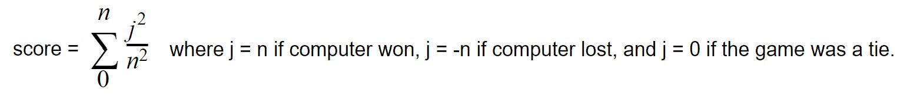

# Rock Paper Scissors AI
A full stack python Flask artificial intelligence project capable of beating the human user over 60% of the time using a custom scoring system to ensemble six models (naïve logic-based, decision tree, neural network) trained on both game-level and stored historical data in AWS RDS Cloud SQL database.

[Play the game here](https://rps-ai-game.herokuapp.com/)

# App

### Overview
Although at first glance, Rock Paper Scissors might seem like a low level game, I actually came to think of it in the opposite way when conceiving it. These days, it is easy to assume that a computer can beat you in chess, because it can harness all of its computing power to see all possible outcomes and choose the ones that benefit it. Rock Paper Scissors, on the other hand, is a game that seems impossible to be good at. It seems that decisions can be made at random and have no less likelihood of winning than a well thought-through decision. My theory though, was that humans can’t actually make random decisions, and that if an AI could learn to understand the ways in which humans make their choices, even if the human is trying to do so in a random pattern, then the AI would be able to significantly exceed 33% accuracy in guessing the player’s decisions. 

I started out by simply hard coding the different ways that I could think of that humans would make decisions: choosing the same thing over and over, choosing in a pattern, or trying to choose the one that they hadn’t used in a while. I built models that would predict the player’s next choice if they were using any of these methods, and then used logic-based criteria to try and decide which model fit the player’s behavior based on a record of the previous rounds. This was the first stage of the project, ran in a jupyter notebook, and initially played pretty well. It would fall into certain patterns easily, however, and could be reliably tricked by a savvy player. 

At this point, I realized that there were a lot of improvements that I could make and got excited to flesh the project out more. I built a Flask webapp and hosted it on Heroku so that I could share it with friends. I then built a cloud database on AWS to capture the data from every time that it was played, knowing that this data could give me the power to build much more sophisticated models.

I began a process of analysing the performance of my models and tweaking them. I also replaced the simple logic-based model selection process with a new scoring system to make the decision of which model would be used to make the next round’s choice, which I’ll go into more detail about below. I created a mobile-friendly app using bootstrap, improved the design for a more engaging user experience, and then sent the link to my network to play against and collect data from.

With this data, I began to implement machine learning models alongside the naive logic-based ones. I created two decision trees, one that trained and predicted only based on game-level data, and one that trained at the start of the game on the full historical data set to make its predictions. At this point, progress slowed as the app’s scope increased, and I had to work through package dependency, data quality, backend, and model exportation issues. However, I continued to iteratively update the app functionality in response to data analysis I was performing and new ideas I continued to have to improve it. In most recent changes, I’ve added a neural network model to replace the locally-trained decision tree which was performing poorly, and updated the scoring system to its current exponential state in order to prioritize recent rounds and ensure unpredictability. These days, even when I play against the AI, I have a hard time beating it. 

### Statistics

My goal was to have the AI win over 55% of the time. Currently, the AI's win percentage sits at 61.5%. 

The top performing model overall is Model 5, which has a made the winning choice 203 times, the losing choice 168 times, and the tying choice 193 times. 

The top performing model based only on the rounds in which it was chosen by the ensembler is Model 2, which has won 37 times against the user, lost 19 times, and tied 31 times. 

### Flask
The app is written in flask and contains a preliminary screen to choose what the winning score will be, the main gameplay page, and a Game Over page in which users can view the game results and start a new game. In its current MVP version, the app can only support one player at a time.

# AI
### Models
model0: Chooses the choice that would lose to or beat the player's last choice. Beats a player that doesn't repeat choices.

model1: Vector-based choice based on past three rounds. Beats a player that chooses in a pattern.

model2: Chooses the choice that would beat the player's most frequent recent choice. Beats a player that repeats choices.

model3: Chooses the choice that would beat the player's least frequent recent choice. Beats a player that changes their choice constantly.

model4: Uses a neural network model trained with historical data to predict the player's next choice.

model5: Uses a decision tree model trained with historical data to predict the player's next choice.

### Ensembling
Every round, the computer_choice function chooses which model it will use as the AI’s choice for the coming round. This is done by scoring the performance of each model given the current game record. 

This scoring system is exponential in order to prioritize recent model performance, making it responsive to strategies that a player might be using. Firstly, this allows the model to overcome simple patterns that a player may be using, such as playing the same choice constantly or switching choices in a repeated pattern. Secondly, it ensures that the same model is not consistently repeated, which would allow for the player to figure out how it worked and beat it. If the player did figure out a model, it would lose and quickly earn a negative score due to the priority that exponential scoring places on the most recent rounds. And finally, it allows the models that may more accurately predict the player’s thinking to be used more frequently. The decision tree and neural network models are given a +0.15 boost to their scores in order to give these sophisticated models precedence in the decision making process. 

